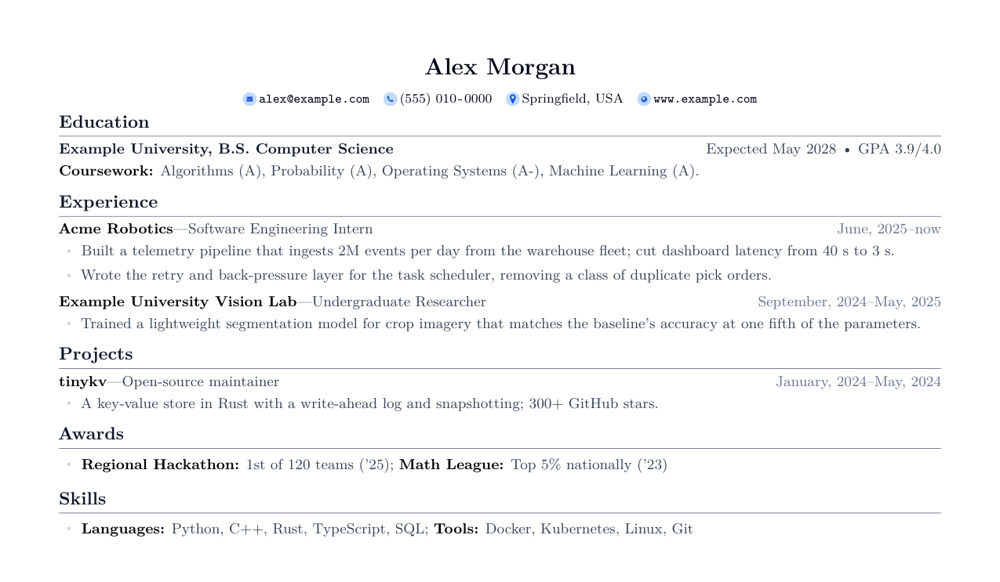

# Clean resume

A one-page LaTeX resume class with a clean single-column layout.



## Usage

`main.tex` is a complete, fictional example. Copy it, replace the content, and build:

```bash
latexmk -pdf -output-directory=build main.tex
```

`clean-resume.cls` and `tailwind-colors.sty` are the only files a resume needs next to it.

## Class options

| Option | Meaning |
|---|---|
| `primary=<color>` | Accent colour, any Tailwind palette name (`blue`, `slate`, ...). |
| `margin=<length>` | Page margin. |
| `linespace=<factor>` | Line spacing. |
| `element-gap=<length>` | Vertical gap between entries. |
| `sidebar-width=<length>` | Width of the sidebar in the two-column layout. |
| `microtype` | Enables microtype. Under pdfLaTeX it adds font expansion; under XeTeX/LuaTeX it keeps protrusion only, so the class builds with either engine. |

The `experience` environment takes `compact` to tighten the spacing between bullets.
